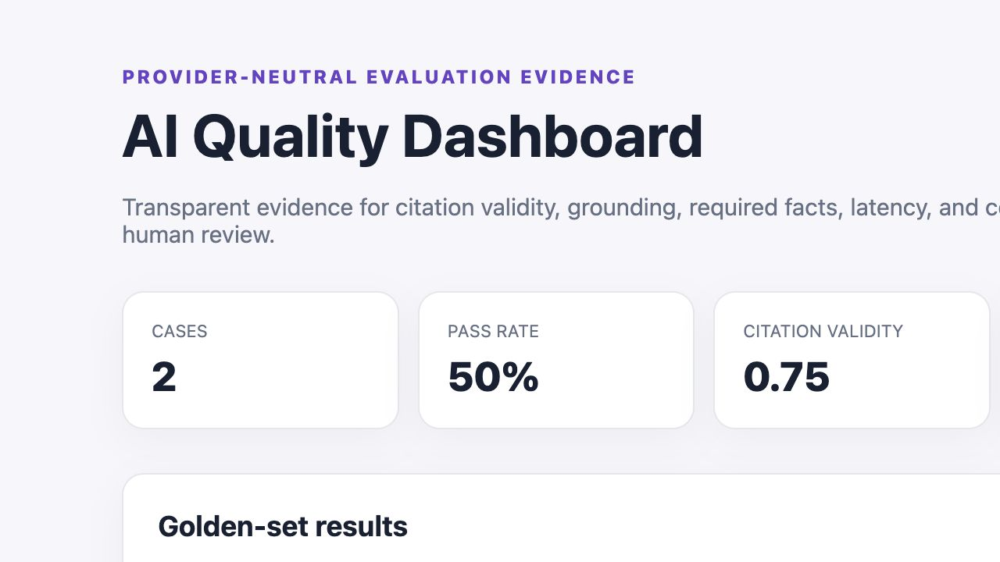
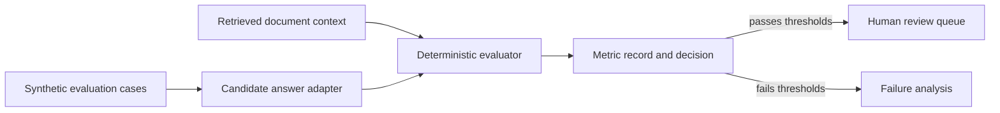

# AI Document Intelligence Evaluator


**Applied AI · RAG Evaluation · Evidence Grounding · Human Review**

A provider-neutral evaluation harness for document-question answering. It scores evidence coverage, citation validity, lexical groundedness, latency, and estimated cost before a result is accepted for human review.

[Evaluation demo](#quick-start) · [Case study](docs/CASE_STUDY.md) · [Metrics](docs/METRICS.md) · [Source](https://github.com/alianisreyesr/ai-document-intelligence-evaluator)

> **AI boundary:** The documents and answers are fictional. Scores support evaluation and triage; they do not prove factual correctness and must not replace qualified human review.

## Portfolio preview



The visual is generated from the synthetic golden set and the same deterministic scoring code exercised by the API and tests.

## Why this project

An AI application is not trustworthy because it produces fluent text. Teams need repeatable evidence about whether answers reference available sources, cover expected facts, remain grounded in retrieved context, and operate within latency and cost targets.

## Evaluation dimensions

| Metric | Question answered |
|---|---|
| Citation validity | Do cited source identifiers exist? |
| Evidence coverage | Were expected supporting documents cited? |
| Groundedness proxy | How much answer language is supported by context? |
| Required-fact recall | Did the answer include the expected facts? |
| Latency | Did the response meet the service target? |
| Estimated cost | Is the model interaction within budget? |

## Architecture



## Quick start

```bash
python -m venv .venv
source .venv/bin/activate
python -m pip install -r requirements.txt
python -m app.cli data/evaluation_cases.json
python -m app.report --input data/evaluation_cases.json --output reports/evaluation-dashboard.html
python -m pytest
uvicorn app.main:app --reload
```

Example output:

```text
CASE-001 PASS citation_validity=1.00 coverage=1.00 groundedness=0.86 facts=1.00 latency_ms=420 cost_usd=0.0018
CASE-002 FAIL citation_validity=0.50 coverage=0.50 groundedness=0.64 facts=0.50 latency_ms=1280 cost_usd=0.0042
```

## API

- `GET /health` — runtime and AI boundary
- `POST /api/evaluations` — evaluate a candidate answer and evidence
- `GET /api/thresholds` — transparent acceptance thresholds

## What it demonstrates

- AI evaluation as tested software rather than a notebook-only experiment
- Deterministic and explainable scoring
- Provider-neutral request/response contracts
- Per-case latency and cost observability
- Batch pass-rate, average metric, and failure-frequency reporting
- Threshold decisions and human-review routing
- Self-contained HTML/JSON evaluation report
- Synthetic golden dataset and regression tests

## Limitations

Lexical overlap is a transparent baseline, not semantic entailment. A production evaluation program would add model-based graders with calibration, adversarial datasets, bias and safety testing, retrieval diagnostics, prompt/model versioning, privacy controls, monitoring, and sampled expert review.

## Target roles

AI Application Engineer · AI Quality Engineer · Backend Engineer · Data Scientist

---

Built by [Alianis Reyes-Reyes](https://www.linkedin.com/in/alianis-reyes-reyes/).
