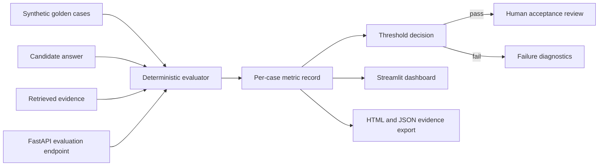
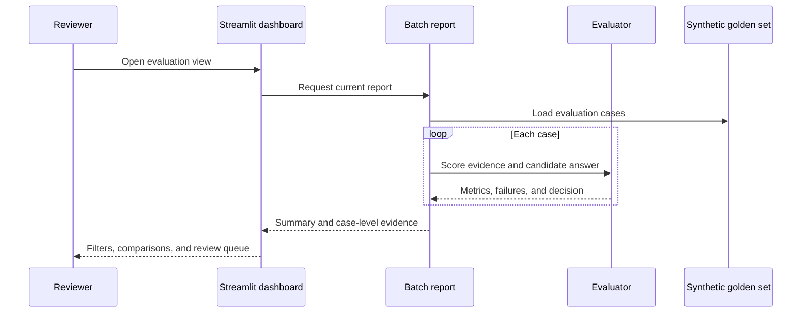
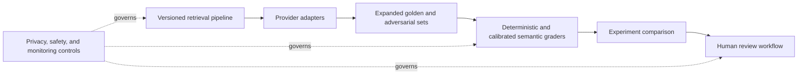

# Architecture

## Runtime boundaries

The evaluator is provider-neutral and deterministic. The Streamlit dashboard reads the same batch report as the CLI and FastAPI layer; it does not implement a separate scoring path.

## Production evolution

